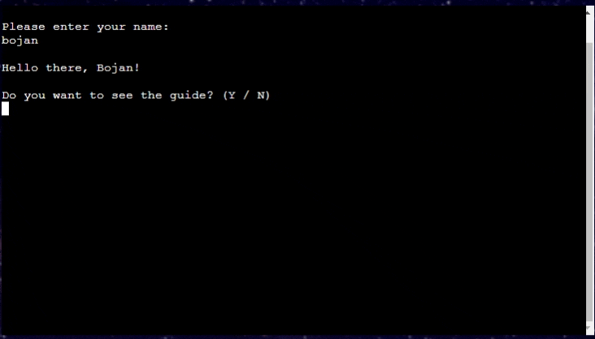
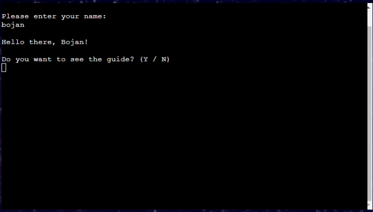

# **SPACE-QUIZ - Testing** 

[Main README.md file](/README.md)

[Visit the live site](https://space-quiz.herokuapp.com/ "Link to Space Quiz")

[GitHub Repository](https://github.com/Boiann/space-quiz "Link to GitHub Repository")

---
## **Contents**
* [Automated Testing](#automated-testing)

* [Manual Testing](#manual-testing)
  * [Testing User Stories](#testing-user-stories)
  * [Full Testing](#full-testing)

* [Bugs](#bugs)
  * [Known Bugs](#known-bugs)
  * [Solved Bugs](#solved-bugs)

---

## Automated Testing

The [CI Python Linter](https://pep8ci.herokuapp.com/) service was used to validate the Python code used, showing no errors.

[Back to top ⇧](#space-quiz---testing)

---

## **Manual Testing**

### **Testing User Stories**

* **I want to know what is this site for**
    * When the page loads it is clear right away what this page is for. The animated background (gif), paired with automatic intro (quote, message and ASCII art) make it obvious this is a space-themed quiz.
* **I want to find additional info/instructions**
    * The user is asked about wanting to see the guide/rulebook of the quiz at before the quiz starts
* **I want to have numbers in my username**
    * The user is allowed to use any number or letter (no special characters), maximum of 12 letters/numbers and a minimum of 2. The name is also capitalised.
* **I want to know more about the answer I got wrong**
    * After every question is answered, there is an option to 'know more', regardless of the user's answer being right or wrong
* **I want to restart the quiz and keep my username**
    * After the quiz ends and the leaderboard is displayed, the user is asked about restarting quiz, if the user selects yes, the question about keeping the username is presented
* **I want no bugs or issues with the game**
    * All of user's inputs are given feedback, and all of the erroneous inputs are warned about, there is no way for the user to 'break' the program.
    (The author is still very new to programming, so this claim is valid for 'normal' user. There might be a way of breaking the program the author is unaware of at this time.) 

### **Full Testing**

Manual testing was done mainly by the author. The code was ran in GitPod terminal over and over for bug checking, loops and functions performance and UX considerations. At later stage it was thoroughly tested after deployment on Heroku. The project was submitted to 'peer-code-review' channel on Slack with no issues raised. Author's brother and a couple of colleagues were given direction to 'break' the program, no breaking occurred but some issues were raised. More about them in [Bugs](#bugs) section of this readme file.

Testing present features:

 - Intro clear screen, quote and ASCII art
  

 

 - Name input ok, capitalize name
  

 
 
 - Name input errors
  

 

 - Guide/rulebook question Y input and display
  

 

 - Guide/rulebook question N input and display
  

 

 - Guide/rulebook input error
  

 

 - Question/answers display, answer correct
  

 

 - Question/answers display, answer wrong
  

 

 - Question/answers display, hint input
  

 

 - Question/answers display, input error
  

 

 - Know more display, 'Y' input
  

 

 - Know more display, 'N' input
  

 

 - Know more display input error
  

 

 - Quiz over message and score
  

 

 - Score colour and message change
  

 

 - Updating leaderboard
  

 

 - Leaderboard display
  

 

 - Quiz replay 'N' input, outro quote
  

 

 - Quiz replay error input
  

 

 - Quiz replay 'Y', username question 'Y' input
  

 

 - Quiz replay 'Y', username question 'N' input
  

 

 - Quiz replay 'Y', username question error input
  

 

 - Favicon and dynamic background/GIF
  

 

 - GitHub and Youtube icon, 'Run Program' button hover colour change
  

 

 - GitHub icon opening page in new tab
  

 

 - Youtube icon opening page in new tab
  

 

 

==SPOILER regarding secret username==

 - Secret username input result
  

 

 - Secret username score message
  
 
 

 

[Back to top ⇧](#space-quiz---testing)

---

## **Bugs**

### **Known Bugs**

- The emojis (thumbs up and thumbs down after correct/wrong answer in the quiz) don't always render properly for user on Mozilla Firefox . The author did not manage to find a solution to fix this. After discussion with author's mentor the decision was made to leave the emojis in.
- Not so much a bug, but having the requirements to put the '\n' for every input is not something the author likes, it changed the Ux slightly. This rule was given to CI students in regards using the [Code Institute template](https://github.com/Code-Institute-Org/python-essentials-template "Link to CI Python template") for this project. The instruction was to put the '\n' for every input or else it would not print to the terminal.

### **Solved Bugs**

There were many 'small' bugs the author had to deal with during the development of the project. Most of them were squashed by doing a quick [Google](https://google.com/ "Google home page") search and using [Stack Overflow](https://stackoverflow.com/ "Stack Overflow home page") to find relevant solutions.

Few of the 'bigger' and more memorable bugs:
 - Inability to properly apply background image(GIF) to the project webpage. It took a lot of research and a very careful inspection of [Harry Potter Adventure Game](https://harry-potter-adventure-game.herokuapp.com/ "Link to Harry Potter Adventure Game") to conclude that the image cannot be applied by saving it to assets/images and then using a file path. The solution was to host the image on [Imgur](https://imgur.com/ "Link to Imgur page") to get it to work.
 - Bug where the player's wrong inputs were adding to the score, solved by careful inspection of the code.
 - Inability to restart the program from the beginning from within the CLI. After many tries with the codes that didn't work and many hours online, the solution was found, and code adapted from [this](https://stackoverflow.com/questions/46112605/python3-issue-with-calling-execopen-read-inside-a-function "Link to restart program") Stack Overflow page.
 - Bug where there would sometimes be an ASCII escape code printed in the outro quote. This was brought on by author's own lack of attention. The whole quote was copied from the [Carl Sagan quotes webpage](https://www.goodreads.com/author/quotes/10538.Carl_Sagan "Link to Carl Sagan quotes webpage"), including the website's quotes (not actual input quotes).
 - Inability to open preview of the webpage whilst adjusting HTML and CSS. The author contacted the tutoring service available as student of Code Institute. The solution was not found but it was suggested to install Live View extension for GitPod workspace, which author installed. After some time on Google the half-solution was found [here](https://www.gitpod.io/docs/introduction/languages/html "Link to HTML/CSS in GitPod"). By inputting 'python -m http.server 8000' into the terminal a list of directories/files would open on a new webpage, and after clicking 'views' it was possible to somewhat see what was needed to adjust the background/spacing/flex-display.

[Back to top ⇧](#space-quiz---testing)